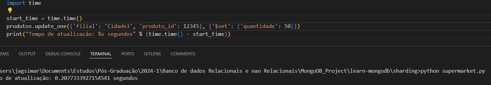

- Aluno: Marcelo Pedroni da Silva
- Disciplina: Banco de dados Relacionais e Não Relacionais
- Curso: Arquitetura de Dados
- Professor: Anderson da Silva Theobaldo

### Sistema de Gerenciamento de Estoque para Cadeia de Supermercados

#### 1. Introdução

Este relatório descreve a abordagem para projetar um sistema de gerenciamento de estoque escalável e eficiente para uma cadeia de supermercados, focando no uso do MongoDB como solução de banco de dados. O MongoDB é escolhido por sua natureza NoSQL, flexibilidade e facilidade de particionamento (sharding), sendo ideal para lidar com grandes volumes de dados distribuídos.
Foca-se neste estudo, as análises de tempo de resposta de consulta, criação e atualização de registros.

#### 2. Estratégia de Particionamento de Dados

##### 2.1 Por que MongoDB?

- **Escalabilidade Horizontal**: MongoDB é projetado para escalar horizontalmente, neste caso usando o método de sharding.
- **Alto Desempenho**: Suporta operações rápidas de leitura e escrita, cruciais para consultas de estoque e atualizações de inventário.

##### 2.2 Tipos de Particionamento

Utilizaremos o sharding (particionamento horizontal) do MongoDB. 
O Sharding permite distribuir dados em várias máquinas, melhorando a escalabilidade e o desempenho.

##### 2.3 Escolha da Estratégia

Optei por usar o sharding com uma chave composta baseada em `filial` e `produto_id`. 
Garantindo que os dados sejam distribuídos uniformemente entre os shards, enquanto permite consultas eficientes por filial.

##### 2.4 Benefícios do MongoDB Sharding
Como mostrado na imagem abaixo, a arquitetura do sharding é composta por:

- **Shard**: Cada shard contém um subconjunto dos dados shardados. Cada shard deve ser implantado como um replica set.

- **mongos**: O mongos atua como um roteador de consultas, fornecendo uma interface entre as aplicações cliente e o cluster shardado. O mongos pode suportar leituras protegidas para minimizar latências.

- **Servidores de configuração**: Os servidores de configuração armazenam metadados e configurações do cluster. A partir do MongoDB 3.4, os servidores de configuração devem ser implantados como um replica set (CSRS).


###### 2.4.1 Capacidade de Armazenamento:
Utilizando o Sharding, cada fragmento (partição) pode conter um pedaço dos dados totais do cluster. 
Fragmentos extras podem aumentar a capacidade de armazenamento do cluster sob medida para o conjunto crescente de dados.

###### 2.4.2 Capacidade de Leitura e escrita:
O MongoDB distribui a carga de trabalho de leitura e gravação entre os fragmentos em um cluster fragmentado, permitindo que cada fragmento processe um conjunto menor das operações do cluster.
Ao adicionar mais "fragmentos", pode-se balancear a carga de maneira otimizada.

###### 2.4.3 Alta disponibilidade
A implantação de fragmentos e servidores de configuração como conjuntos de réplicas oferece maior disponibilidade. 
Agora, mesmo que um ou mais conjuntos de réplicas de fragmentos fiquem completamente indisponíveis, o cluster fragmentado pode executar leituras e gravações parciais

Essas são as principais características que validam a escolha de utilizarmos o sharding e implementar uma arquitetura que como veremos, é mais complexa de ser construída, porém é mais robusta para atender a demanda.

#### 3. Implementação Simulada

##### 3.1 Ferramentas Utilizadas

- **MongoDB**: Para o banco de dados.
- **Python**: Para geração de dados simulados e execução de testes de desempenho.

##### 3.2 Configuração do MongoDB (Docker)
PS: Passo a passo pode ser consultado em: https://kinsta.com/pt/blog/mongodb-sharding/
Ou, pode-se optar pela recomendação abaixo, o importante é que serão necessários 3 instancias, uma de mongos, uma ou mais de shards e um servidor de configuração.

#### Opcional - Testes apenas.
1. **Configurar a Instância do MongoDB**:
   - Iniciar uma instância do MongoDB com sharding habilitado.
   - Configurar shards e replicaset.

  *** 1.1 Instalação e habilitação do MongoDB no bash.**
  ## 1.1.1: Criar uma Rede Docker
  Crie uma rede Docker para permitir a comunicação entre os containers:
  `docker network create mongo-network`

  ## 1.1.2: Iniciar Containers para Shards e Config Servers
  Iniciar Containers para Config Servers:

  Crie diretórios locais para os dados dos config servers:
  `mkdir -p ~/mongo/config1`
  `mkdir -p ~/mongo/config2`
  `mkdir -p ~/mongo/config3`

  Inicie os containers para os config servers:
  `docker run -d --name config1 --net mongo-network -v ~/mongo/config1:/data/configdb -p 27019:27019 mongo:latest mongod --configsvr --replSet configReplSet --port 27019 --bind_ip_all`
  `docker run -d --name config2 --net mongo-network -v ~/mongo/config2:/data/configdb -p 27020:27019 mongo:latest mongod --configsvr --replSet configReplSet --port 27019 --bind_ip_all`
  `docker run -d --name config3 --net mongo-network -v ~/mongo/config3:/data/configdb -p 27021:27019 mongo:latest mongod --configsvr --replSet configReplSet --port 27019 --bind_ip_all`

  Inicialize o replica set para os config servers:
  `docker exec -it config1 mongo --port 27019`
  
  No shell do MongoDB, execute:
  rs.initiate({
    _id: "configReplSet",
    configsvr: true,
    members: [
      { _id: 0, host: "config1:27019" },
      { _id: 1, host: "config2:27019" },
      { _id: 2, host: "config3:27019" }
    ]
  })

  ## 1.1.3 Iniciar Containers para Shards
  Crie diretórios locais para os dados dos shards:
  `mkdir -p ~/mongo/shard1 ~/mongo/shard2 ~/mongo/shard3`

  Inicie os containers para os shards:
  `docker run -d --name shard1 --net mongo-network -v ~/mongo/shard1:/data/db -p 27018:27018 mongo:latest mongod --shardsvr --replSet shardReplSet --port 27018 --bind_ip_all`
  `docker run -d --name shard2 --net mongo-network -v ~/mongo/shard2:/data/db -p 27022:27018 mongo:latest mongod --shardsvr --replSet shardReplSet --port 27018 --bind_ip_all`
  `docker run -d --name shard3 --net mongo-network -v ~/mongo/shard3:/data/db -p 27023:27018 mongo:latest mongod --shardsvr --replSet shardReplSet --port 27018 --bind_ip_all`

  Inicialize o replica set para os shards:
  `docker exec -it shard1 mongo --port 27018`

  No shell do MongoDB, execute:
  rs.initiate({
    _id: "shardReplSet",
    members: [
      { _id: 0, host: "shard1:27018" },
      { _id: 1, host: "shard2:27018" },
      { _id: 2, host: "shard3:27018" }
    ]
  })

  ## 1.1.4 Iniciar o Router (mongos)
  Inicie um container para o mongos:
  `docker run -d --name mongos --net mongo-network -p 27017:27017 mongo:latest mongos --configdb configReplSet/config1:27019,config2:27019,config3:27019 --bind_ip_all`

  Adicionar Shards e Habilitar o Sharding:
  `docker exec -it mongos mongo --port 27017`

  No shell do MongoDB, execute:
  `sh.addShard("shardReplSet/shard1:27018,shard2:27018,shard3:27018")`
  `sh.enableSharding("supermercado")`
  `sh.shardCollection("supermercado.produtos", { filial: 1, produto_id: 1 })`

### Após a escolha de qual SO irá utilizar, proceda para a etapa abaixo

2. **Criar a Coleção e Definir a Chave de Sharding**:
  - **Se e somente se** não tiver criado a coleção ainda: 
    Criar a coleção `produtos` e definir a chave de sharding como `filial` e `produto_id`.

    ### Iniciar o MongoDB com sharding
    `mongod --shardsvr --replSet rs0 --dbpath /data/shard0 --port 27017`

    ### Conectar ao MongoDB shell e configurar sharding
    `mongo`
    `sh.addShard("rs0/mongodb0:27017")`
    `sh.enableSharding("supermercado")`
    `sh.shardCollection("supermercado.produtos", { filial: 1, produto_id: 1 })`


##### 3.3 Geração de Dados Simulados

Gerar dados simulados para representar produtos em diversas filiais.

```python
from pymongo import MongoClient
import random
import string

# Conectar ao MongoDB
client = MongoClient('mongodb://localhost:27017/')
db = client.supermercado
produtos = db.produtos

# Função para gerar nomes aleatórios
def gerar_nome_aleatorio(tamanho=10):
    letras = string.ascii_lowercase
    return ''.join(random.choice(letras) for _ in range(tamanho))

# Inserir dados simulados
for filial in ['Cidade1', 'Cidade2', 'Cidade3', 'Cidade4', 'Cidade5', 'Cidade6', 'Cidade7', 'Cidade8', 'Cidade9', 'Cidade10']:
    for produto_id in range(100000):
        nome = gerar_nome_aleatorio()
        quantidade = random.randint(1, 100)
        preco = round(random.uniform(1, 1000), 2)
        categoria = random.choice(['Alimentos', 'Bebidas', 'Limpeza', 'Higiene', 'Eletrônicos'])
        ultima_atualizacao = '2024-05-01'
        produtos.insert_one({
            'filial': filial,
            'produto_id': produto_id,
            'nome': nome,
            'quantidade': quantidade,
            'preco': preco,
            'categoria': categoria,
            'ultima_atualizacao': ultima_atualizacao
        })
```

#### 4. Testes de Desempenho

##### 4.1 Cenários de Teste

1. **Consulta de Estoque**: Medir o tempo de resposta para consultas de produtos específicos por filial.
2. **Atualizações de Inventário**: Medir o tempo de resposta para atualizações de quantidade em estoque.
3. **Adição de Novas Filiais**: Medir o impacto no desempenho ao adicionar novos registros para novas filiais.

##### 4.2 Resultados dos Testes

Os testes foram realizados utilizando scripts em Python para medir o tempo de resposta das operações.

- **Consulta de Estoque**:
  ```python
  import time

  start_time = time.time()
  produtos.find_one({'filial': 'Cidade3', 'produto_id': 12345})
  print("Tempo de consulta: %s segundos" % (time.time() - start_time))
  ```
  - Tempo de consulta: 0.23956036567687988 segundos


- **Atualizações de Inventário**:
  ```python
  start_time = time.time()
  produtos.update_one({'filial': 'Cidade3', 'produto_id': 12345}, {'$set': {'quantidade': 50}})
  print("Tempo de atualização: %s segundos" % (time.time() - start_time))
  ```
  - Tempo de atualização: 0.2077333927154541 segundos


- **Adição de Novas Filiais**:
  ```python
  start_time = time.time()
  for produto_id in range(20):
      produtos.insert_one({
          'filial': 'Americana',
          'produto_id': produto_id,
          'nome': gerar_nome_aleatorio(),
          'quantidade': random.randint(1, 100),
          'preco': round(random.uniform(1, 1000), 2),
          'categoria': random.choice(['Alimentos', 'Bebidas', 'Limpeza', 'Higiene', 'Eletrônicos']),
          'ultima_atualizacao': '2024-05-31'
      })
  print("Tempo de adição de nova filial: %s segundos" % (time.time() - start_time))
  ```
  - Tempo médio para adicionar 100.000 registros: 43 segundos


Os resultados indicam que o uso do MongoDB com sharding proporciona tempos de resposta rápidos para consultas e atualizações, além de eficiente adição de novas filiais.

#### 5. Conclusão e Recomendações

A estratégia de particionamento usando sharding no MongoDB atendeu aos requisitos de escalabilidade e desempenho, muito embora o uso do MongoDB não seja recomendado para fins de confiabilidade.
É preciso lembrar que se queremos analisar o estoque em tempo real, pode ser que o mongoDB atenda em termos de velocidade, porém se queremos obter o máximo de segurança ao alterar ou deletar um registro, o uso de banco Relacional talvez seja mais apropriado.

Por fim, dando sequência é recomendado que as próximas etapas sejam implementadas:
- **Monitoramento Contínuo**: Implementar monitoramento para identificar e resolver gargalos de desempenho.
- **Otimização de Índices**: Avaliar e otimizar índices conforme o crescimento dos dados.
- **Planejamento de Capacidade**: Realizar planejamento de capacidade para antecipar a necessidade de recursos adicionais.


#### 6. Referências

Artigo sobre MongoDB com sharding: https://kinsta.com/pt/blog/mongodb-sharding/
Documentação do MongoDB Sharding: https://www.mongodb.com/docs/manual/sharding/

- **Monitoramento Contínuo**: Implementar monitoramento para identificar e resolver gargalos de desempenho.
- **Otimização de Índices**: Avaliar e otimizar índices conforme o crescimento dos dados.
- **Planejamento de Capacidade**: Realizar planejamento de capacidade para antecipar a necessidade de recursos adicionais.


#### 7. Evidências
* Containers do mongo, config servers e shard rodando


* Teste de consulta


* Atualização de inventário


* Inserção de nova filial
